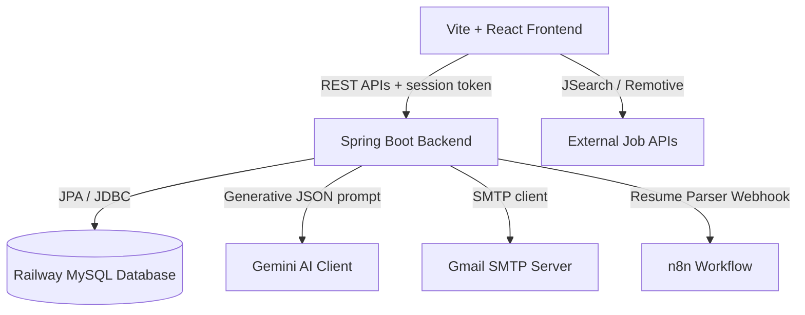

# AI Job Assistant — Project Brief

This document provides a comprehensive overview of the **AI Job Assistant** application, details its component architecture, explains its core features, and outlines the system deployment topology.

---

## 1. Overview & Goal

The **AI Job Assistant** is a web-based copilot designed to help job seekers find, track, match, and apply for jobs with the assistance of Artificial Intelligence.

* **Frontend**: React (v18), TypeScript, Vite, styled using Vanilla CSS and Tailwind-like utility classes. Deployed on **Vercel**.
* **Backend**: Spring Boot (v3.5), Java 17, JPA (Hibernate), REST APIs. Deployed on **Railway**.
* **Database**: MySQL database hosted on Railway.
* **AI Engine**: Google Gemini 2.5 Flash (for resume parsing, persona generation, and job matching/scoring).

---

## 2. Core Modules & Features

### 🔍 Job Discovery (Feature-Flagged)
* **Gated Access**: Controlled by the `VITE_FEATURE_JOB_DISCOVERY=true` flag. When disabled, the navigation button is hidden, and the route redirects to a disabled state page.
* **External Job Sources**:
  * **Primary**: JSearch API (via RapidAPI) — offers robust search queries using skill combinations and remote filters.
  * **Fallback**: Remotive Remote Jobs API — queries space-separated terms to handle remote-only roles if the JSearch API limit is reached.
* **Performance Cache**: Implement a client-side 30-second cache to prevent duplicate external API calls during rapid filter changes or input debounces.

### 🧠 Gemini Match Scoring
* **Comprehensive Matching**: Scores external jobs on a `0-100` scale based on a candidate's complete profile.
* **Profile Integration**: Fetches user preferences directly from the database (Target Role, Job Type, Location, Experience, Skills, Aspirations, Interests) along with the **parsed resume summary**.
* **Scoring Rubric**:
  * **Core Skills Match (35%)**: Requirement alignment with candidate skills.
  * **Resume & Experience Match (30%)**: Seniority matching against years of experience and resume text.
  * **Preference Match (20%)**: Target title, remote status, and location check.
  * **Aspirations & Interests (15%)**: Alignment with long-term goals.

### 📊 Job Tracker & Dashboard Auto-Sync
* **Free Users**: Can "Save" jobs. The job is automatically added to their main job tracker dashboard (`UserJob` table with status `saved`).
* **Premium Users**: Can click **Request Apply**. This marks the job as `pending_admin_apply` and raises a real-time notification to the Administrator.
* **Database Sync**: The `DiscoveredJob` table is automatically linked to the core `Job` and `UserJob` tables under the hood using transactional SQL mapping.

### 🗓️ Weekly Progress Tracker
* Enables users to check in weekly, tracking completed applications, interviews, and goals.
* Generates an automated AI Persona representing the user's career status and momentum.
* Allows administrators to generate comprehensive CSV reports of all candidate activities.

---

## 3. Tech Stack & Integration Topology

### Key Directories and Files:

#### 📁 Backend (`AiJobAssistantBackEnd`)
* `com.cd.model`: Contains JPA Entities (`User`, `Job`, `UserJob`, `DiscoveredJob`, `WeeklyCheckin`).
* `com.cd.repository`: Spring Data JPA repositories.
* `com.cd.service`: Business services (`DiscoveredJobService`, `UserService`, `WeeklyProgressService`).
* `com.cd.controller`: REST APIs (`DiscoveredJobController`, `UserController`, `WeeklyProgressController`).
* `resources/application-prod.properties`: Environment variable configuration for production Railway deployment.

#### 📁 Frontend (`AiJobAssistantFrontEnd-dev`)
* `src/components/JobDiscovery.tsx`: Main React component for the Job Discovery panel.
* `src/lib/jobDiscoveryApi.ts`: API wrapper for fetching and scoring external jobs.
* `src/config/features.ts`: Feature flag settings.
* `src/App.tsx` & `src/components/Sidebar.tsx`: Global routing and navigation entrypoints.

---

## 4. Deployment Topology

### Frontend (Vercel)
* Build Command: `node --max-old-space-size=4096 node_modules/.bin/vite build` (increased memory limit to prevent build crashes).
* Output Directory: Configured to `build` via `vercel.json`.
* Backend URL: Injected via `VITE_API_BASE_URL` in `.env`.

### Backend (Railway)
* Build Engine: Nixpacks, compiling using `./mvnw clean package -DskipTests`.
* Startup Command: `java -Dspring.profiles.active=prod -jar target/AI-Job-Assistant-0.0.1-SNAPSHOT.jar`.
* Database: MySQL container provisioned in the same Railway project, automatically injecting host, port, database name, and credentials.
